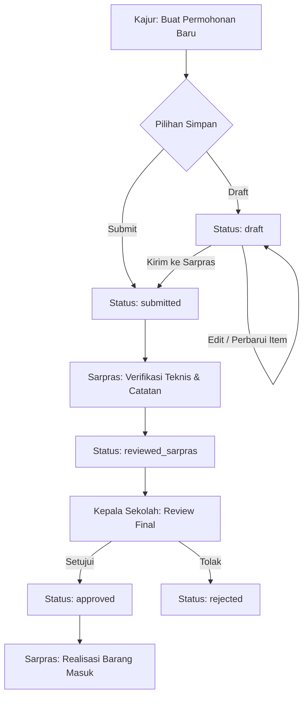
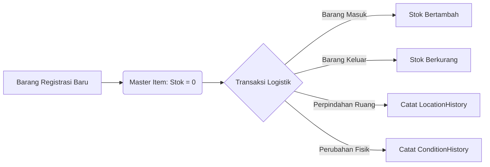
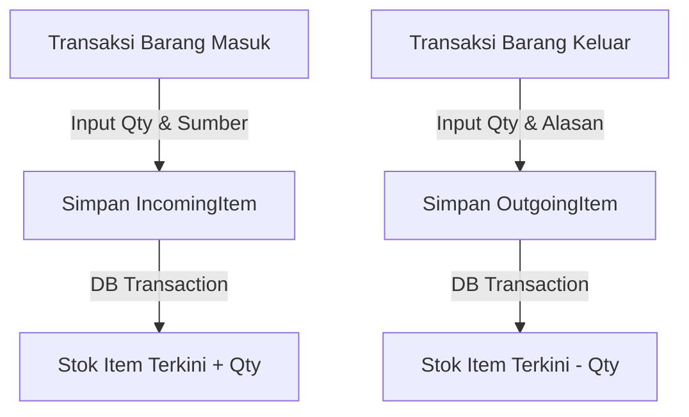

# Sistem Informasi Inventaris dan Logistik Sekolah (SIILS)

**Sistem Informasi Inventaris dan Logistik Sekolah Berbasis Web secara Terpusat**

Sistem Informasi Inventaris dan Logistik Sekolah (SIILS) adalah aplikasi manajemen aset, transaksi logistik (barang masuk, barang keluar, dan distribusi), pengajuan permohonan kebutuhan inventaris multi-item, manajemen dokumen/BAST terlampir, serta rekapitulasi laporan berwewenang multi-peran (*multi-role*). Sistem ini dirancang untuk memastikan tata kelola sarana prasarana sekolah transparan, efisien, dan memiliki rekam jejak audit (*audit trail*) yang tidak dapat diubah sembarangan. Semua data pengguna dilindungi dengan verifikasi status aktif serta autentikasi kata sandi terenkripsi.

---

## 📋 Daftar Isi
- [1. Fitur Utama](#1-fitur-utama)
- [2. Role dan Alur Akses](#2-role-dan-alur-akses)
- [3. Gambaran Alur Sistem](#3-gambaran-alur-sistem)
- [4. Panduan Penggunaan Bertahap per Role](#4-panduan-penggunaan-bertahap-per-role)
- [5. Tech Stack](#5-tech-stack)
- [6. Instalasi Lokal](#6-instalasi-lokal)
- [7. Menjalankan Test](#7-menjalankan-test)
- [8. Struktur Folder Penting](#8-struktur-folder-penting)
- [9. Continuous Integration](#9-continuous-integration)
- [10. Catatan Desain yang Disengaja](#10-catatan-desain-yang-disengaja)
- [11. Catatan Teknis](#11-catatan-teknis)
- [12. Glosarium](#12-glosarium)
- [13. Status Pengembangan dan Batasan Scope](#13-status-pengembangan-dan-batasan-scope)
- [14. Troubleshooting dan FAQ](#14-troubleshooting-dan-faq)
- [15. Cara Berkontribusi](#15-cara-berkontribusi)
- [16. Lisensi](#16-lisensi)

---

## 1. Fitur Utama

| Fitur | Keterangan |
|---|---|
| **Autentikasi & Guard Status Aktif** | Autentikasi berbasis session (Email atau Username) dengan pencegahan login otomatis untuk pengguna berstatus nonaktif (`is_active = 0`). |
| **Dashboard Ringkasan Multi-Role** | Halaman utama read-only yang menampilkan total aset inventaris, jumlah lokasi, dan pengajuan pending sesuai konteks wewenang. |
| **Pengajuan Barang Multi-Item** | Pembuatan permohonan kebutuhan sarana prasarana oleh Kajur yang mendukung pendaftaran banyak jenis item dalam satu pengajuan. |
| **Edit Draft Pengajuan** | Fitur khusus Kajur untuk memperbarui detail dan daftar barang pengajuan selama statusnya masih berstatus `draft`. |
| **Verifikasi & Formulasi Sarpras** | Peninjauan teknis dan pencatatan pertimbangan ketersediaan oleh pihak Sarpras sebelum diajukan ke Kepala Sekolah. |
| **Approval Kepala Sekolah** | Keputusan persetujuan (*approved*) atau penolakan (*rejected*) oleh Kepala Sekolah yang disertai catatan resmi keputusan. |
| **Master Inventaris & Agregat Stok** | Pengelolaan data barang master (1 kode = 1 jenis barang) dengan perhitungan stok otomatis real-time. |
| **Log Barang Masuk & Barang Keluar** | Transaksi pencatatan barang masuk (pembelian/bantuan) yang menambah stok dan barang keluar (rusak/pemusnahan) yang mengurangi stok. |
| **Distribusi & Penyaluran** | Alokasi fisik inventaris ke ruangan atau unit kejuruan penerima beserta Berita Acara Penyaluran. |
| **Tracking Riwayat Lokasi & Kondisi** | Pencatatan otomatis setiap perpindahan lokasi (`location_histories`) dan perubahan kondisi fisik (`condition_histories`). |
| **Manajemen Dokumen & BAST** | Unggah, pengunduhan aman, dan penghapusan dokumen pendukung (Nota, BAST, Foto) terorganisir per kategori. |
| **Laporan Rekapitulasi & Mode Cetak** | Filter laporan berdasarkan jenis transaksi, rentang tanggal, dan jurusan yang dilengkapi halaman khusus siap cetak (*print mode*). |
| **Manajemen Pengguna & Toggle Status** | Pengelolaan data staf pengguna oleh Sarpras termasuk pengaktifan dan penonaktifan akun pengguna. |

---

## 2. Role dan Alur Akses

### Tabel Hak Akses Pengguna

| Role | Halaman Login | Halaman Awal | Ringkasan Hak Akses |
|---|---|---|---|
| **Kajur (Kepala Kejuruan)** | `/login` | `/home` | Membuat & mengedit pengajuan draft, memantau pengajuan, melihat inventaris & laporan terbatas jurusannya, mengunggah dokumen. |
| **Sarpras (Operator & Logistik)** | `/login` | `/home` | Mengelola master barang & lokasi, meninjau pengajuan Kajur, mencatat barang masuk/keluar/distribusi, manajemen dokumen, manajemen pengguna. |
| **Kepala Sekolah** | `/login` | `/home` | Meninjau pengajuan berstatus `reviewed_sarpras`, memberikan keputusan approval/reject, memantau seluruh laporan rekapitulasi sekolah. |

### Aturan Akses & Batasan Konteks Jurusan
- **Penyimpanan Role & Guard:** Peran pengguna disimpan pada kolom `role` di tabel `users` (`kajur`, `sarpras`, `kepala_sekolah`). Pemeriksaan otorisasi dilakukan melalui custom middleware `App\Http\Middleware\RoleMiddleware`.
- **Pengalihan Akses Ditolak:** Jika pengguna mencoba mengakses URL milik peran lain (misal Kajur mengakses `/sarpras/inventory`), sistem menghentikan eksekusi dengan response **403 Forbidden**.
- **Pencegahan Login Non-Aktif:** Pengguna dengan `is_active = false` tidak dapat login meskipun kata sandi benar.
- **Konteks Jurusan (Department Scoping):** Kajur hanya dapat melihat dan mengelola data yang terikat dengan nama jurusannya (`user->department`). Sarpras dan Kepala Sekolah memiliki wewenang global seluruh sekolah.
- **Rute Terbuka Umum:** Hanya rute `/login` yang dapat diakses oleh tamu (*guest*). Seluruh rute aplikasi lainnya wajib terautentikasi (`auth`).

---

## 3. Gambaran Alur Sistem

### (a) Alur Pengajuan Barang (Draft -> Process -> Approval)


*Penjelasan:* Kajur menyusun kebutuhan dalam status `draft`. Setelah di-submit, Sarpras memberikan catatan teknis, dan Kepala Sekolah memberikan keputusan akhir disetujui atau ditolak.

### (b) Alur Pengelolaan Master Barang, Lokasi, dan Kondisi


*Penjelasan:* Data master barang terpisah dari riwayat fisik. Perpindahan ruangan dan perubahan kondisi disimpan sebagai data riwayat bertambah (*append-only*).

### (c) Alur Stok Masuk dan Keluar


*Penjelasan:* Perubahan stok barang masuk dan keluar diproses dalam satu transaksi database atomik untuk menjamin konsistensi stok.

---

## 4. Panduan Penggunaan Bertahap per Role

### A. Panduan Tugas Kajur (Kepala Kejuruan)

#### Tugas 1: Membuat Pengajuan Barang Multi-Item
1. Buka browser dan navigasi ke URL `/login`.
2. Masukkan username `kajur_rpl` dan password `password123`, lalu klik **Masuk**.
3. Pilih menu **Pengajuan Barang** > **Buat Pengajuan Baru**.
4. Isi **Judul Pengajuan** dan **Maksud & Tujuan**.
5. Pada baris item barang, masukkan Nama Barang, Jumlah, Satuan, Estimasi Harga, dan Spesifikasi.
6. Klik tombol **Tambah Item Lainnya** jika ingin menambah barang kedua/ketiga.
7. Klik **Simpan Sebagai Draft** atau **Ajukan Langsung ke Sarpras**.
   

#### Tugas 2: Mengedit Draft Pengajuan
1. Masuk ke menu **Pengajuan Barang** > **Daftar Pengajuan**.
2. Klik tombol **Detail** pada pengajuan yang berstatus *Draft*.
3. Klik tombol **Edit Draft** di bagian bawah halaman.
4. Ubah jumlah, nama barang, atau spesifikasi item kebutuhan.
5. Klik **Simpan Perubahan Draft** atau **Simpan & Kirimkan ke Sarpras**.
   

---

### B. Panduan Tugas Sarpras (Operator & Logistik)

#### Tugas 1: Memproses Pengajuan Kajur
1. Login dengan akun Sarpras (`sarpras` / `password123`).
2. Masuk ke menu **Administrasi** > **Review Pengajuan Kajur**.
3. Klik tombol **Detail & Telaah** pada daftar permohonan berstatus *Menunggu Review*.
4. Masukkan **Catatan Telaah Sarpras** pada form verifikasi.
5. Klik **Kirimkan ke Kepala Sekolah**. Status berubah menjadi `reviewed_sarpras`.
   

#### Tugas 2: Pencatatan Log Barang Masuk
1. Masuk ke menu **Logistik** > **Barang Masuk**.
2. Pilih nama barang inventaris dari dropdown.
3. Masukkan jumlah kuantitas barang, sumber asal (Pembelian/Bantuan), nama asal toko/instansi, dan tanggal masuk.
4. Klik **Simpan Transaksi Barang Masuk**. Stok master barang otomatis bertambah.
   

#### Tugas 3: Mengunggah Berkas / BAST
1. Masuk ke menu **Dokumen & Berkas**.
2. Klik **Unggah Dokumen Baru**.
3. Isi Judul Dokumen, pilih Kategori (Nota/BAST/Surat Bantuan/Foto/Umum), dan pilih file PDF/Gambar (max 10MB).
4. Klik **Simpan Dokumen**.
   

---

### C. Panduan Tugas Kepala Sekolah

#### Tugas 1: Memberikan Approval Pengajuan
1. Login dengan akun Kepala Sekolah (`kepsek` / `password123`).
2. Masuk ke menu **Persetujuan Pengajuan**.
3. Klik **Review & Putuskan** pada pengajuan yang memerlukan persetujuan.
4. Periksa rincian item barang dan catatan telaah Sarpras.
5. Masukkan catatan persetujuan pada kolom **Catatan Kepala Sekolah**.
6. Klik **Setujui Pengajuan** atau **Tolak Pengajuan**.
   

#### Tugas 2: Filter dan Cetak Laporan
1. Masuk ke menu **Laporan & Monitoring**.
2. Pilih jenis rekapitulasi (Inventaris, Barang Masuk, Barang Keluar, Distribusi, atau Pengajuan).
3. Tentukan rentang tanggal dan jurusan (jika diperlukan), lalu klik **Filter**.
4. Klik tombol **Cetak** untuk membuka halaman versi cetak bebas komponen navigasi web.
   

---

## 5. Tech Stack

- **Backend Framework:** Laravel v11.x / PHP v8.5+
- **Frontend Template & UI:** Blade Engine, Metronic Design System, Tailwind CSS, Bootstrap Icons
- **Bundler Asset:** Vite v5.x
- **Database (Development/Local):** SQLite / MySQL v8.0 / MariaDB
- **Database (Testing):** SQLite In-Memory / File Database
- **Framework Pengujian:** PHPUnit v12.x / Laravel Testing Toolkit

---

## 6. Instalasi Lokal

### Kebutuhan Server Lokal
- PHP >= 8.2 (dengan ekstensi: `openssl`, `pdo_sqlite`, `sqlite3`, `mbstring`, `fileinfo`, `curl`, `zip`)
- Composer >= 2.0
- Web Server (PHP Built-in Server / XAMPP / Laragon)

### Langkah Instalasi (Command Line)

```bash
# 1. Clone repository proyek
git clone https://github.com/Moefkiim/Sistem-Informasi-Inventaris-dan-Logistik-Sekolah-Berbasis-Web.git
cd Sistem-Informasi-Inventaris-dan-Logistik-Sekolah-Berbasis-Web

# 2. Install seluruh dependensi PHP via Composer
composer install

# 3. Salin file lingkungan dari .env.example
cp .env.example .env

# 4. Generate Kunci Aplikasi Laravel
php artisan key:generate

# 5. Buat file database SQLite (jika menggunakan SQLite default)
touch database/database.sqlite

# 6. Jalankan migrasi tabel dan seeder data awal
php artisan migrate:fresh --seed

# 7. Hubungkan folder penyimpanan media dokumen
php artisan storage:link

# 8. Jalankan server pengembang lokal
php artisan serve
```
Aplikasi siap dibuka pada peramban web di tautan: `http://127.0.0.1:8000`.

---

### Penjelasan Variabel Konfigurasi `.env`

| Variabel `.env` | Fungsi Konfigurasi | Contoh Nilai Aman |
|---|---|---|
| `APP_NAME` | Nama aplikasi yang tampil pada judul halaman | `SIILS Sekolah` |
| `APP_ENV` | Mode lingkungan aplikasi (local/production) | `local` |
| `APP_KEY` | Kunci enkripsi enkripsi session & password | `base64:...` *(auto generated)* |
| `APP_URL` | URL domain utama server | `http://localhost:8000` |
| `DB_CONNECTION` | Driver database (sqlite / mysql) | `sqlite` |
| `DB_DATABASE` | Path file SQLite atau nama DB MySQL | `database/database.sqlite` |

---

### Akun Demo Default dari Seeder

> ⚠️ **Peringatan:** Akun demo di bawah ini dihasilkan dari `DatabaseSeeder.php` dan hanya ditujukan untuk lingkungan pengujian lokal. Jangan gunakan kata sandi ini pada server produksi live!

| Peran (Role) | Username | Password | Keterangan / Jurusan |
|---|---|---|---|
| **Kajur RPL** | `kajur_rpl` | `password123` | Kepala Kejuruan RPL |
| **Sarpras** | `sarpras` | `password123` | Staf Sarana Prasarana Sekolah |
| **Kepala Sekolah** | `kepsek` | `password123` | Kepala Sekolah |
| **User Nonaktif** | `user_nonaktif` | `password123` | Pengujian blokir login |

### Membuat Akun Pengguna Baru
Pendaftaran akun secara mandiri (*self-registration*) ditiadakan untuk menjaga keamanan. Seluruh akun pengguna baru (Kajur/Staf) dibuat secara eksklusif oleh pihak **Sarpras** melalui menu **Manajemen Pengguna** (`/sarpras/users`).

---

## 7. Menjalankan Test

Proyek ini telah dilengkapi dengan suite pengujian otomatis berbasis PHPUnit untuk menguji alur autentikasi dan pembatasan hak akses antar peran.

### Perintah Pengujian

```bash
# Jalankan seluruh unit & feature test
php artisan test

# Jalankan pengujian khusus file otorisasi dan role
php artisan test --filter=AuthenticationAndRoleAccessTest
```

### Tabel Cakupan File Test

| File Test | Cakupan & Fitur yang Diuji |
|---|---|
| `tests/Feature/AuthenticationAndRoleAccessTest.php` | Pengujian render halaman login, autentikasi via Email & Username, penolakan kata sandi salah, pencegahan login user nonaktif, logout, serta isolasi rute antar role (Response 403). |
| `tests/Feature/ExampleTest.php` | Pengujian dasar status halaman utama aplikasi. |

---

## 8. Struktur Folder Penting

```text
.
├── app/
│   ├── Http/
│   │   ├── Controllers/
│   │   │   ├── Auth/AuthController.php      # Form & proses login/logout
│   │   │   ├── Kajur/                       # Form pengajuan & inventaris jurusan
│   │   │   ├── Principal/ApprovalController # Form approval Kepala Sekolah
│   │   │   ├── Sarpras/                     # Inventory, Logistics, Location, User CRUD
│   │   │   ├── DocumentController.php       # Manajemen upload/download berkas
│   │   │   └── ReportController.php         # Rekapitulasi laporan & print export
│   │   └── Middleware/
│   │       └── RoleMiddleware.php           # Guard hak akses berbasis role
│   └── Models/                              # Model Eloquent aplikasi
├── database/
│   ├── migrations/                          # Skema tabel database (10 tabel utama)
│   └── seeders/DatabaseSeeder.php           # Data seeder akun demo
├── resources/
│   └── views/                               # Template UI Blade Metronic & Tailwind
├── routes/
│   └── web.php                              # Pemetaan rute terproteksi middleware
├── AGENTS.md                                # Aturan bisnis & instruksi pengembang AI
├── rancangan-web.md                         # Spesifikasi arsitektur & rancangan awal
└── README.md                                # Dokumentasi utama panduan proyek
```

---

### Tabel Model Utama Database

| Model Eloquent | Tabel Database | Keterangan & Relasi Utama |
|---|---|---|
| `User` | `users` | Mengelola data kredensial, role (`kajur`, `sarpras`, `kepala_sekolah`), jurusan, dan status aktif (`is_active`). |
| `Item` | `items` | Master aset inventaris. Memiliki kolom `code`, `stock`, `current_condition`, `department`, `location_id`. *SoftDeletes*. |
| `Submission` | `submissions` | Permohonan barang. Memiliki `status` (`draft`, `submitted`, `reviewed_sarpras`, `approved`, `rejected`, `cancelled`). |
| `SubmissionItem` | `submission_items` | Rincian item barang dalam satu pengajuan (relasi `belongsTo(Submission)`). |
| `IncomingItem` | `incoming_items` | Log transaksi barang masuk yang menambah stok master item. |
| `OutgoingItem` | `outgoing_items` | Log transaksi barang keluar (rusak/pemusnahan) yang mengurangi stok master. |
| `Distribution` | `distributions` | Penyaluran inventaris ke lokasi/jurusan penerima. |
| `Location` | `locations` | Master lokasi gedung/ruangan/laboratorium. *SoftDeletes*. |
| `LocationHistory` | `location_histories` | Riwayat transaksi mutasi lokasi perpindahan fisik barang. |
| `ConditionHistory` | `condition_histories` | Riwayat pencatatan perubahan kondisi fisik barang. |
| `Document` | `documents` | Data meta dan path berkas fisik (Nota, BAST, Foto). *SoftDeletes*. |

---

## 9. Continuous Integration

*Belum tersedia.* Sistem CI/CD otomatis (seperti GitHub Actions) belum dikonfigurasi pada repositori ini. Seluruh pengujian saat ini dijalankan secara lokal menggunakan perintah `php artisan test`.

---

## 10. Catatan Desain yang Disengaja

> 📌 **Pembuka Wajib:** Perilaku di bagian ini sengaja dibuat demikian sesuai aturan bisnis sekolah dan dapat terlihat seperti bug bagi pengguna awam. Jangan mengubah perilaku ini tanpa membaca dokumentasi aturan bisnis di `AGENTS.md` dan `rancangan-web.md`.

1. **Perilaku:** Pengajuan barang tidak dapat diubah atau dihapus oleh Kajur setelah dikirim (`submitted`).
   - *Alasan Sengaja:* Mencegah manipulasi data barang saat Sarpras atau Kepala Sekolah sedang melakukan peninjauan.
   - *Test Pengunci:* `AuthenticationAndRoleAccessTest::test_kajur_can_access_kajur_area_but_forbidden_from_other_roles`.

2. **Perilaku:** Transaksi Barang Masuk dan Keluar tidak menyediakan tombol *Delete* bebas pada UI.
   - *Alasan Sengaja:* Menjaga keutuhan rekam jejak audit log (*audit trail*). Pembatalan atau koreksi transaksi logistik dilakukan melalui transaksi penyesuaian berpemilik wewenang Sarpras.

3. **Perilaku:** Penghapusan Master Barang dan Lokasi menggunakan mekanisme *Soft-Delete*.
   - *Alasan Sengaja:* Menghindari kerusakan integritas relasi (*broken foreign keys*) pada tabel riwayat transaksi logistik masa lalu.

4. **Perilaku:** Pengguna yang dinonaktifkan (`is_active = false`) langsung ditolak saat login meskipun password benar.
   - *Alasan Sengaja:* Memastikan mutasi atau pencabutan wewenang staf yang sudah tidak bertugas berlaku seketika pada sesi login.
   - *Test Pengunci:* `AuthenticationAndRoleAccessTest::test_inactive_user_cannot_login`.

5. **Perilaku:** Perubahan lokasi dan kondisi barang selalu menambah baris baru pada tabel riwayat.
   - *Alasan Sengaja:* Prinsip *append-only tracker* diterapkan agar seluruh kronologi usia pemakaian aset sekolah dapat dilacak dari awal barang diterima.

---

## 11. Catatan Teknis

- **Privasi & Keamanan Data:** Sandi pengguna dienkripsi menggunakan algoritma `Bcrypt` dengan faktor biaya 12. Seluruh form input wajib dilengkapi proteksi `CSRF` token.
- **Driver Database:** Konfigurasi default menggunakan driver `SQLite` untuk kemudahan pengujian pengembang lokal. Untuk deployment lingkungan produksi, disarankan menggunakan database engine server seperti `MySQL 8.0` atau `MariaDB 10.6+`.
- **Manajemen Storage File:** Berkas dokumen terlampir disimpan dalam direktori privat `storage/app/public/documents` dan diakses melalui rute terautentikasi `DocumentController@download` untuk mencegah pengunduhan ilegal langsung via URL publik.

---

## 12. Glosarium

| Istilah | Arti & Penjelasan Domain |
|---|---|
| **Kajur** | Kepala Kejuruan, unit struktural pengaju permohonan kebutuhan inventaris jurusan. |
| **Sarpras** | Staf pengelola Sarana dan Prasarana sekolah yang mengontrol fisik aset dan logistik. |
| **BAST** | Berita Acara Serah Terima, berkas legalitas penyerahan fisik barang/bantuan. |
| **Draft** | Status awal pengajuan barang yang masih dapat disunting secara bebas oleh pengaju. |
| **Soft-Delete** | Metode penghapusan logika di mana record ditandai `deleted_at` tanpa menghapus baris database. |
| **Audit Trail** | Catatan kronologis peristiwa sistem yang merekam siapa, kapan, dan transaksi apa yang dilakukan. |

---

## 13. Status Pengembangan dan Batasan Scope

### Tabel Status Fitur Aplikasi

| Fitur Aplikasi | Status Pengoperasian | Catatan Implementasi |
|---|:---:|---|
| **Autentikasi & Guard Active Status** | ✅ Sudah | Teruji via PHPUnit test suite |
| **Dashboard Statistics** | ✅ Sudah | Read-only aggregate counts |
| **Pengajuan Multi-Item Kajur** | ✅ Sudah | Mendukung input dinamis banyak item |
| **Edit Draft Pengajuan Kajur** | ✅ Sudah | Terbatas pada status `draft` |
| **Review & Telaah Sarpras** | ✅ Sudah | Catatan ketersediaan & verifikasi |
| **Approval Kepala Sekolah** | ✅ Sudah | Keputusan setuju / tolak + catatan |
| **Log Barang Masuk & Keluar** | ✅ Sudah | Auto update stok master barang |
| **Distribusi Barang** | ✅ Sudah | Alokasi ke ruangan / jurusan |
| **Riwayat Lokasi & Kondisi** | ✅ Sudah | Append-only history logging |
| **Manajemen Dokumen & BAST** | ✅ Sudah | Upload, download, & delete Sarpras |
| **Cetak Laporan / Print Export** | ✅ Sudah | Tampilan bebas elemen navigasi web |
| **Manajemen User Sarpras** | ✅ Sudah | CRUD staf & toggle `is_active` |

### Status Teknis

| Aspek Teknis | Status | Keterangan |
|---|:---:|---|
| **CI/CD** | ✅ Terpasang | Workflow GitHub Actions (`tests.yml`) menjalankan `php artisan test` otomatis pada push/PR ke `main`. |
| **Konsistensi CSS** | ✅ Terkonsolidasi | UI konsisten dengan gaya Metronic/Bootstrap 5; halaman `documents/index.blade.php` telah diseragamkan dan bebas dari Tailwind utility di area view terpakai. |
| **Indeks Database** | ✅ Tersedia | Migration `2026_10_04_012000_add_indexes_to_inventory_and_submissions` menambah indeks pada tabel `inventories`, `submissions`, `submission_items`, dan `documents` untuk optimasi query. |
| **Catatan Desain yang Disengaja** | ✅ Tercatat | Field sensitif (`status`, `role`, `is_active`, dll.) sengaja dikeluarkan dari `$fillable` — controller (dan test yang memerlukan transisi state) WAJIB mengubahnya melalui set properti eksplisit (`$model->field = $value; $model->save()`) sesuai alur transisi yang benar, bukan via mass-assignment. |

### Batasan Scope (Strict Scope Boundaries)
Sistem ini secara eksplisit **TIDAK MEMILIKI** dan **DILARANG MENAMBAHKAN** fitur di bawah ini tanpa persetujuan resmi:
- Barcode / QR Code Scanner
- Notifikasi Otomatis via WhatsApp / Email
- Aplikasi Mobile (Android / iOS)
- Payment / Financial Accounting
- Supplier Management Sistem
- Integrasi Pihak Ketiga lainnya

---

## 14. Troubleshooting dan FAQ

#### Masalah: Gagal mengunduh file dokumen yang baru diunggah (`404 Not Found`).
- *Penyebab:* Tautan simbolik (*symbolic link*) antara folder `storage/app/public` dan `public/storage` belum dibuat.
- *Solusi:* Jalankan perintah `php artisan storage:link` pada terminal terminal Anda.

#### Masalah: Kajur tidak melihat tombol edit pada halaman detail pengajuan.
- *Penyebab:* Pengajuan tersebut sudah dikirimkan (*submitted*) atau dalam proses peninjauan oleh Sarpras.
- *Solusi:* Sesuai aturan desain, tombol edit hanya muncul apabila status pengajuan masih `draft`.

#### Masalah: Terjadi error `SQLSTATE[HY000]: General error: 1 no such table`.
- *Penyebab:* File database SQLite belum dibuat atau tabel migrasi belum dijalankan.
- *Solusi:* Jalankan perintah `touch database/database.sqlite` diikuti dengan `php artisan migrate:fresh --seed`.

---

## 15. Cara Berkontribusi

1. Tinjau dan pahami seluruh aturan bisnis serta matriks akses pada [AGENTS.md](file:///c:/Ibang/KULIAH/Semester%205/Sistem-Informasi-Inventaris-dan-Logistik-Sekolah-Berbasis-Web/AGENTS.md) dan [rancangan-web.md](file:///c:/Ibang/KULIAH/Semester%205/Sistem-Informasi-Inventaris-dan-Logistik-Sekolah-Berbasis-Web/rancangan-web.md).
2. Buat branch fitur baru dari `main` dengan format penamaan: `docs/fitur-nama` atau `fix/deskripsi-bug`.
3. Lakukan pengujian otomatis menggunakan `php artisan test` sebelum mengajukan Pull Request (PR).
4. Kirimkan PR dan sertakan ringkasan perubahan serta langkah verifikasi uji yang telah dilakukan.

---

## 16. Lisensi

Proyek Sistem Informasi Inventaris dan Logistik Sekolah (SIILS) ini dikembangkan untuk kebutuhan internal pengelolaan sarana prasarana sekolah. Lisensi dan pemanfaatan sistem dikelola oleh tim pengembang sekolah.
